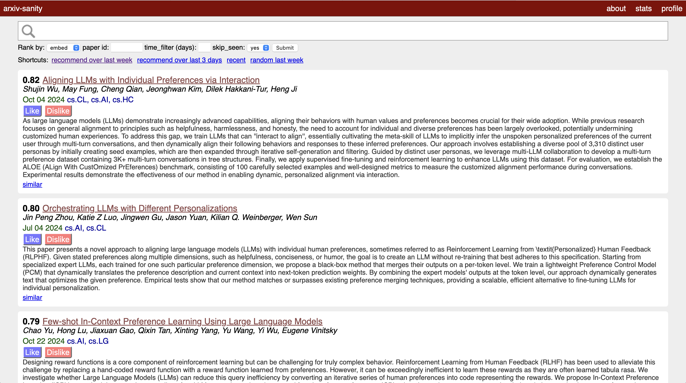

# arxiv-sanity-vecs

A revision of [arxiv-sanity-lite](https://github.com/karpathy/arxiv-sanity-lite) that finds related papers by using personalized embeddings, rather than TF-IDF vectors.

Users can create accounts, which will then create a personal embedding for you as a user. As you "Like" and "Dislike" papers, your personal embedding is moved closer to papers that you like and farther from papers that you don't like.
Then, each day when new papers are pulled in, we can recommend papers to you based on abstract embeddings that are nearest-neighbors to your personal embedding.



#### To run

First, you need to obtain a Huggingface Access Token and set it inside of `config.py`.

Then, to run this locally I usually run the following script to update the database with any new papers. 
I typically schedule this via a periodic cron job:
```bash
#!/bin/bash
source ~/.virtualenvs/flaskpy3/bin/activate

cd ~/arxiv-sanity-vecs/

python3 arxiv_daemon.py --num 20000

if [ $? -eq 0 ]; then
    echo "New papers detected! Running compute.py"
    python3 seq_embeddings.py
else
    echo "No new papers were added, skipping feature computation"
fi
```

You can see that updating the database is a matter of first downloading the new papers via the arxiv api using `arxiv_daemon.py`, and then running `seq_embeddings.py` to compute the sentence embeddings of the papers. Finally to serve the flask server locally we'd run something like:

```bash
export FLASK_APP=serve.py; flask run
```

All of the data will be stored inside the `data` directory. Finally, if you'd like to run your own instance on the interwebs I recommend simply running the above on a [Linode](https://www.linode.com), e.g. I was running this code on the smallest "Nanode 1 GB" instance indexing about 30K papers, which costs $5/month.

To run this on Linode, you need to compute embeddings _locally_, and then push the embeddings/databases up to Linode.
This is because the CPU constraints on the cheapest boxes are too severe to run personalized updates/sentence transformers.

#### Requirements

 Install via requirements:

 ```bash
 pip install -r requirements.txt
 ```

#### Credits

Of course, enormous credit to Andrej's [arxiv-sanity-lite](https://github.com/karpathy/arxiv-sanity-lite), which serves as the basis for all of the Flask work here. 
And to [Huggingface](https://huggingface.co) for sentence-transformers and some strong free models.

#### License

MIT
